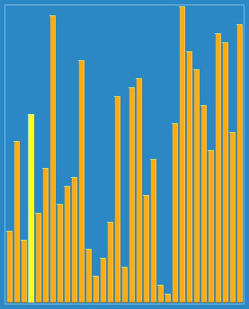

排序算法(Java 实现)
=====================

| 算法种类|时间复杂度 最好情况 平均情况 最坏情况 |空间复杂度| 稳定性|示例|
|:------:|:-----:|:------:|:---:|:---:|
|[冒泡排序](#冒泡排序)|O(n) &nbsp; &nbsp; &nbsp;  &nbsp; &nbsp; &nbsp;  |O(1)|是|是|
|[选择排序](#选择排序)| &nbsp; &nbsp; &nbsp;   &nbsp; &nbsp; &nbsp;  |O(1)|否|是|
|[归并排序](#归并排序)|  |O(n)|是|是|
|[快速排序](#快速排序)|   ||否|是|
|[插入排序](#插入排序)|O(n) &nbsp; &nbsp; &nbsp;   &nbsp; &nbsp; &nbsp;  |O(1)|是|是|
|[希尔排序](#希尔排序)||O(1)|否|是|
|[堆排序](#堆排序)|  |O(1)|否|是|
|基数排序|O(d(n+r)) O(d(n+r)) O(d(n+r))|O(r)|是|否|
|[鸡尾酒排序](#鸡尾酒排序) |O(n) &nbsp; &nbsp; &nbsp;   &nbsp; &nbsp; &nbsp; |O(1)|是|否|
|[地精排序](#地精排序)|O(n) &nbsp; &nbsp; &nbsp;   &nbsp; &nbsp; &nbsp; |O(1)|是|是|
|梳排序|   |O(1)|否|否|

## 冒泡排序

 冒泡排序(Bubble Sort)是一种简单的排序算法。它重复地走访过要排序的数列，一次比较两个元素，如果他们的顺序错误就把他们交换过来。走访数列的工作是重复地进行直到没有再需要交换，也就是说该数列已经排序完成。这个算法的名字由来是因为越小的元素会经由交换慢慢“浮”到数列的顶端。

算法描述如下：

1. 比较相邻的元素。如果第一个比第二个大，就交换他们两个。

2. 对每一对相邻元素作同样的工作，从开始第一对到结尾的最后一对。这步做完后，最后的元素会是最大的数。

3. 针对所有的元素重复以上的步骤，除了最后一个。

4. 持续每次对越来越少的元素重复上面的步骤，直到没有任何一对数字需要比较。

## 选择排序

选择排序(Selection sort)是一种简单直观的排序算法。它的工作原理如下。首先在未排序序列中找到最小元素，存放到排序序列的起始位置，然后，再从剩余未排序元素中继续寻找最小元素，然后放到排序序列末尾。以此类推，直到所有元素均排序完毕。

算法描述如下：

1. 从第一个元素开始，向后依次比较。

2. 若有比第一个元素更小的元素，则交换第一个元素与当前元素，直到全部扫描完成。

3. 此时第一个元素为最小的元素，再从第二个元素开始，重复执行1、2

## 归并排序

归并排序(Merge Sort),是创建在归并操作上的一种有效的排序算法，效率为O(n log n)。1945年由约翰·冯·诺伊曼首次提出。该算法是采用分治法（Divide and Conquer）的一个非常典型的应用，且各层分治递归可以同时进行。

算法描述如下：
1. 采用递归的方法将序列每次进行划分，2路归并则每次划分左右2部分，直到不能再划分为止。

2. 讲划分后的序列，每相邻两个数字进行归并操作，排序后每个序列包含两个元素。

3. 将上述序列再次归并。

4. 重复步骤2，直到所有元素排序完毕。

## 快速排序
快速排序(Quicksort)，又称划分交换排序（partition-exchange sort），一种排序算法，最早由东尼·霍尔提出。在平均状况下，排序n个项目要Ο(n log n)次比较。在最坏状况下则需要Ο(n2)次比较，但这种状况并不常见。

算法描述如下：

1. 从数列中挑出一个元素，称为"基准"(pivot)。

2. 重新排序数列，所有元素比基准值小的摆放在基准前面，所有元素比基准值大的摆在基准的后面（相同的数可以到任一边）。在这个分区结束之后，该基准就处于数列的中间位置。这个称为分区（partition）操作。

3. 递归地（recursive）把小于基准值元素的子数列和大于基准值元素的子数列排序。

递归的最底部情形，是数列的大小是零或一，也就是永远都已经被排序好了。虽然一直递归下去，但是这个算法总会结束，因为在每次的迭代（iteration）中，它至少会把一个元素摆到它最后的位置去。

## 插入排序

插入排序(Insertion Sort)一种简单直观的排序算法。它的工作原理是通过构建有序序列，对于未排序数据，在已排序序列中从后向前扫描，找到相应位置并插入。插入排序在实现上，通常采用in-place排序（即只需用到O(1)的额外空间的排序），因而在从后向前扫描过程中，需要反复把已排序元素逐步向后挪位，为最新元素提供插入空间。

算法描述如下：

1. 从第一个元素开始，该元素可以认为已经被排序。

2. 取出下一个元素，在已经排序的元素序列中从后向前扫描。

3. 如果该元素（已排序）大于新元素，将该元素移到下一位置。

4. 重复步骤3，直到找到已排序的元素小于或者等于新元素的位置。

5. 将新元素插入到该位置后。

6. 重复步骤2~5。

## 希尔排序

希尔排序(ShellSort)，也称递减增量排序算法，是插入排序的一种更高效的改进版本。希尔排序是非稳定排序算法。

希尔排序是基于插入排序的以下两点性质而提出改进方法的：

- 插入排序在对几乎已经排好序的数据操作时，效率高，即可以达到线性排序的效率
- 但插入排序一般来说是低效的，因为插入排序每次只能将数据移动一位

算法描述如下：

1. 设定初始步长GAP。

2. 按步长进行。

3. 对每个分组使用插入排序。

4. 减小步长。

5. 重复步骤2~4,直到步长为1,即整个数列只有1个分组,对最后这个分组执行1次插入排序。

## 堆排序

堆排序(Heapsort)是指利用堆积树（堆）这种数据结构所设计的一种排序算法。可以利用数组的特点快速定位指定索引的元素,堆积是一个近似完全二叉树的结构，并同时满足堆积的性质：即子结点的键值或索引总是小于（或者大于）它的父节点。

算法描述如下：

1. 将序列创建为最大堆(最小堆)。

2. 取出堆中的第一个节点，即为序列的最大值(最小值)。

3. 重新调整堆使之重新满足最大堆(最小堆)的特性。

4. 重复步骤2~3，直到所有序列处理完毕。

## 鸡尾酒排序

鸡尾酒排序(CocktailSort)，也就是定向冒泡排序，鸡尾酒搅拌排序，搅拌排序（也可以视作选择排序的一种变形），涟漪排序，来回排序or 快乐小时排序，是冒泡排序的一种变形。此算法与冒泡排序的不同处在于排序时是以双向在序列中进行排序。当进行一次冒泡后立即进行反向冒泡。

算法描述如下：
1. 对序列进行一次冒泡排序，此时整个序列的最大数(最小数)将会上浮。

2. 对该序列进行一次反向冒泡排序，即最小数(最大数)下沉。

3. 重复1~2步直到整个序列有序。

## 地精排序

地精排序（GnomeSorting，大部分地方翻成“侏儒排序”）最初由哈米德在2000年的时候提出，当时称为傻瓜排序，之后被迪克说明并且命名为“地精排序”。
一个地精在排列一排花盘。他从前至后的排列，如果相邻的两个花盘顺序正确，他向前一步；如果花盘顺序错误，他后退一步，直到所有的花盘的顺序都排列好。

算法描述如下：
1. 对序列进行冒泡，如果相邻两个数顺序不正确，则交换他们。

2. 相互后立即反向冒泡，若相邻两个数顺序不正确，则交换他们,再进行反向。

3. 重复步骤1~2，直到所有序列有序。

